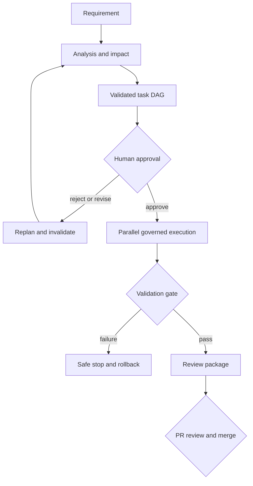

# Architecture and orchestration overview

## Components

| Component | Responsibility | Governance boundary |
|---|---|---|
| TinyURL API | Create, redirect, expiration, aggregate analytics | Input validation and stable HTTP contracts |
| Requirement analyzer | Normalize intent, criteria, assumptions, ambiguity, risks, impact | Deterministic typed output |
| Workflow planner | Produce scenario-specific dependency DAGs | Graph validation rejects cycles and missing dependencies |
| Policy engine | Classify automatic, approval-required, prohibited actions | Agents cannot override decisions |
| Workflow service | Own state transitions, approvals, replanning, lineage | Invalid transitions return conflict |
| Execution engine | Schedule ready tasks, synchronize branches, retry, safe-stop, rollback | Bounded parallelism and retry budget |
| Artifact store | Persist snapshots, events, command digests, metrics, traceability | UUID-constrained paths and atomic snapshots |
| GitHub pull request | Final review and merge | Human-owned release authorization |

## Control flow

## Scenario paths

| Scenario | Key branch/synchronization | Human checkpoint |
|---|---|---|
| Greenfield expiration | Implementation and tests run in parallel, then validation | Plan approval |
| Brownfield Flyway | Recovery/migration and preservation-test paths synchronize | Plan approval plus schema approval |
| Ambiguous analytics | Privacy review and API design branch, then implementation/tests synchronize | Approval of clarified aggregate-only interpretation |

## Decision lineage

Each workflow snapshot retains the source requirement, requirement version,
normalized analysis, task-to-acceptance-criterion mapping, approvals, attempts,
rollback records, replans, and metrics. A changed upstream task invalidates every
transitive dependent; previous approvals are cleared before the replacement plan
can execute.
