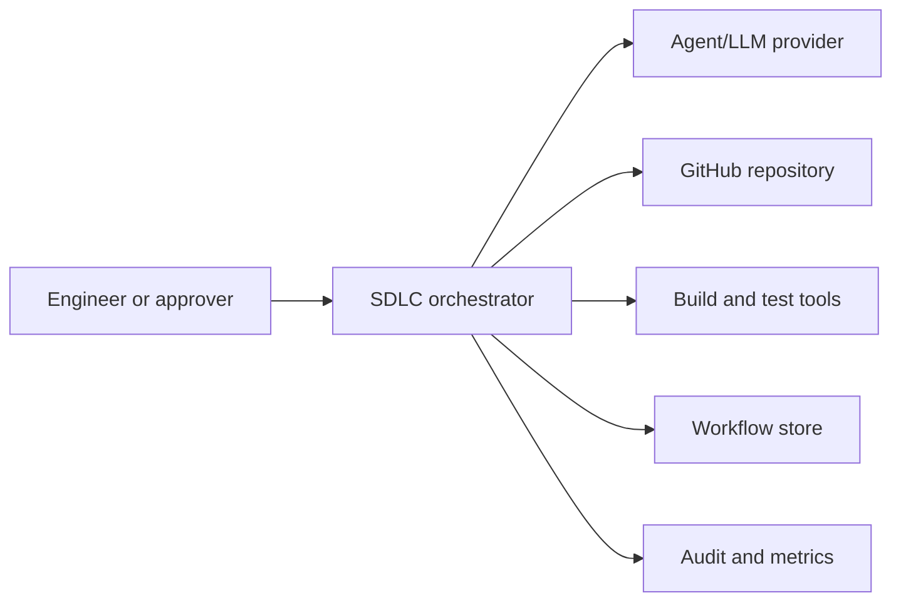
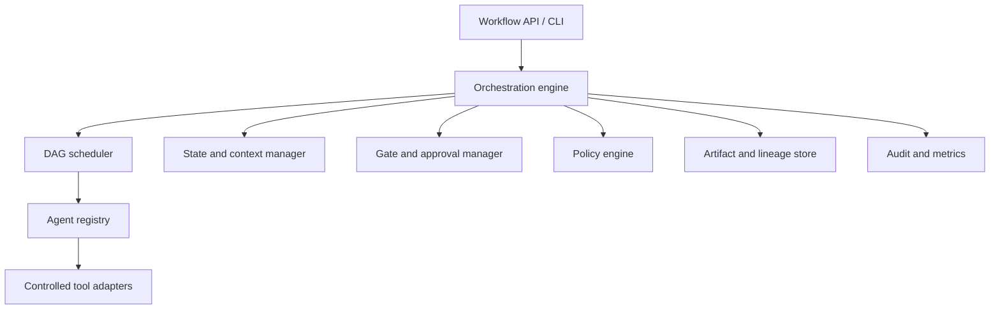
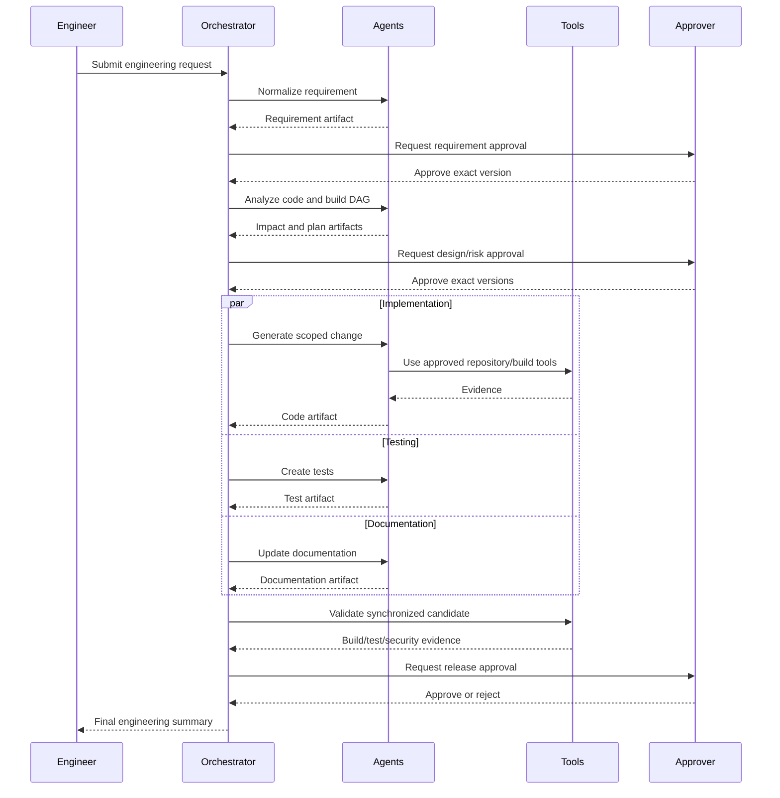
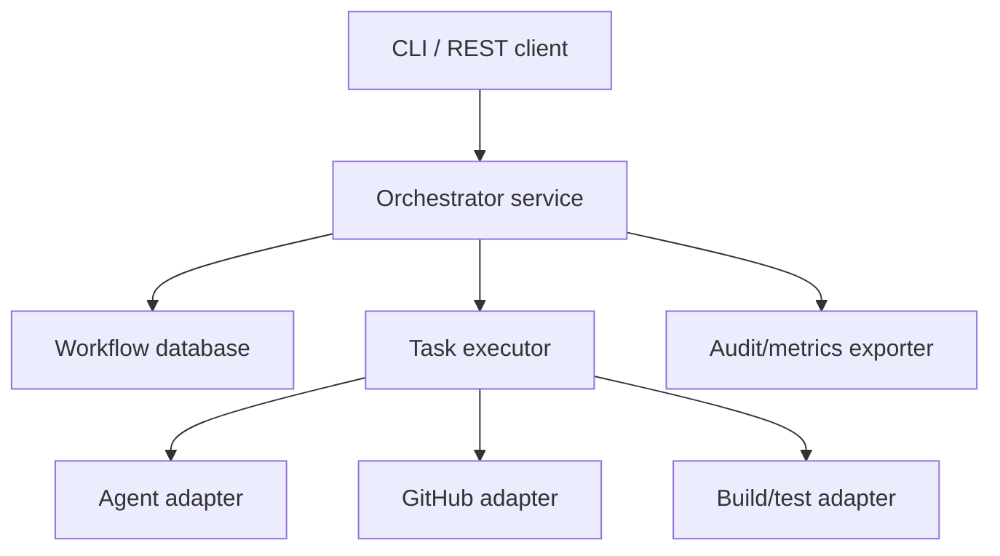

# Agentic SDLC Orchestration Architecture

## 1. Purpose

This document defines the architecture for the agentic SDLC orchestration prototype that uses TinyURL as its working engineering codebase. The orchestrator coordinates requirements, codebase analysis, planning, architecture, implementation, testing, documentation, validation, and release readiness while preserving human governance.

The design is intentionally stateful and dependency-driven. It does not implement the lifecycle as a fixed sequence of prompts. Every workflow is represented as a versioned dependency graph with entry and exit gates, parallel execution, synchronization, retries, selective re-planning, and safe-stop controls.

## 2. Architecture goals

The system must:

- Convert well-defined or ambiguous requests into approved engineering requirements.
- Analyze an existing repository before proposing changes.
- Create and execute an explicit directed acyclic graph (DAG).
- Run independent engineering tasks concurrently.
- Preserve context, decisions, evidence, and artifact lineage across stages.
- Require human approval for high-impact decisions and actions.
- Bound agent autonomy through policies, scopes, and retry limits.
- Recover from transient failures without hiding repeated or unsafe failures.
- Re-plan affected work when upstream inputs change.
- Produce audit-grade workflow history and operational metrics.
- Generate reviewable code, tests, API definitions, and documentation.
- Stop safely when correctness, security, or governance cannot be established.

## 3. System context



### External actors and systems

| Actor or system | Responsibility |
|---|---|
| Engineer | Submits a request, supplies clarification, and reviews outputs |
| Product approver | Approves normalized requirements and business decisions |
| Technical approver | Approves architecture, risk, and release readiness |
| GitHub | Stores source, branches, commits, pull requests, and CI results |
| Build tools | Compile code, run tests, and generate validation evidence |
| Agent provider | Supplies reasoning or generation capability behind a controlled adapter |
| Workflow store | Persists workflow state, graphs, decisions, artifacts, and approvals |
| Observability backend | Stores audit events, logs, traces, and reliability metrics |

## 4. Logical components



### 4.1 Workflow API and CLI

Provides the controlled entry points for:

- Creating a workflow
- Retrieving status and graph state
- Supplying requirement clarification
- Approving or rejecting gates
- Revising an upstream requirement
- Resuming a paused workflow
- Requesting a safe stop
- Retrieving artifacts, events, and metrics

The API does not allow callers to skip mandatory gates or directly force a task to `COMPLETED`.

### 4.2 Orchestration engine

The engine is the authority for workflow transitions. It:

- Validates workflow commands.
- Evaluates task entry and exit conditions.
- Delegates ready work to the scheduler.
- Applies policy decisions.
- Records state transitions before and after execution.
- Handles retry, fallback, rollback, and safe-stop decisions.
- Detects stale downstream outputs.
- Produces the final engineering summary.

Agents cannot directly change workflow state.

### 4.3 DAG scheduler

The scheduler evaluates explicit task dependencies and selects tasks whose prerequisites and gates are satisfied.

Responsibilities:

- Detect invalid or cyclic graphs.
- Identify tasks that are ready.
- Execute independent tasks in parallel.
- Enforce configured concurrency limits.
- Wait at synchronization barriers.
- Prevent downstream execution after a failed dependency.
- Cancel or quarantine work after a safe-stop signal.

### 4.4 State and context manager

Maintains durable cross-stage context:

- Requirement versions
- Current workflow and task states
- Plans and graph versions
- Decisions and assumptions
- Approval records
- Retry budgets
- Policy findings
- Artifact references
- Validation evidence
- Correlation and causation identifiers

It supplies each task only the context required for its scope, reducing accidental leakage and irrelevant prompt context.

### 4.5 Gate and approval manager

Gates convert governance expectations into executable controls.

Gate types:

- Automated quality gate
- Requirement approval
- Architecture and risk approval
- Destructive-change approval
- Release-readiness approval

An approval record includes the approver, role, decision, comments, timestamp, requirement version, plan version, and artifact hashes. Approval of an older version does not authorize a revised version.

### 4.6 Policy engine

The policy engine evaluates proposed and completed actions.

Example policies:

- No direct agent writes to `main`.
- No merge, release, or deployment without human approval.
- No destructive migration without explicit approval and rollback evidence.
- No secret material in prompts, source, logs, or artifacts.
- No commands outside the approved repository and tool scope.
- No bypass of critical security or mandatory validation failures.
- Limit change size and protected-file access.
- Require tests and documentation for public API changes.

Policy results are `ALLOW`, `DENY`, or `REQUIRE_APPROVAL`. A `DENY` result cannot be overridden by an implementation agent.

### 4.7 Agent registry

Agents implement specialized contracts rather than controlling the workflow.

| Agent | Primary output |
|---|---|
| Requirement Agent | Normalized requirements, ambiguities, assumptions, acceptance criteria |
| Codebase Agent | Impact map, dependency analysis, data flow, regression risks |
| Planning Agent | Versioned DAG, sequencing, gates, retry and rollback policies |
| Architecture Agent | API/schema design and architecture decisions |
| Implementation Agent | Scoped source-code changes |
| Test Agent | Test plan, tests, coverage-to-requirement mapping |
| Documentation Agent | README, OpenAPI, runbook, and scenario changes |
| Security Agent | Threat analysis, policy findings, risk classification |
| Validation Agent | Build, test, compatibility, and acceptance evidence |
| Release Agent | Release-readiness and final engineering summary |

Every agent response must conform to a versioned structured schema. Invalid responses are rejected rather than treated as successful task completion.

### 4.8 Controlled tool adapters

Adapters isolate external side effects:

- GitHub read/write adapter
- Branch and commit adapter
- Build/test adapter
- Static-analysis adapter
- Artifact storage adapter
- Agent/LLM adapter
- Notification or approval adapter

Each invocation receives a scoped capability, timeout, idempotency key, and correlation ID. Tool results are treated as evidence, not automatically as proof that a stage succeeded.

### 4.9 Artifact and lineage store

Engineering outputs are immutable, versioned artifacts. Each artifact records:

- Artifact ID and type
- Workflow and task ID
- Requirement and plan version
- Producing agent
- Source artifact IDs
- Repository and commit reference
- Content hash
- Creation timestamp
- Validation status

Lineage enables selective invalidation when an upstream decision changes.

### 4.10 Audit and metrics

The observability component records:

- Workflow and task transitions
- Agent and tool executions
- Human decisions
- Gate evaluations
- Policy results
- Retries and fallback actions
- Rollbacks and safe stops
- Artifact creation and invalidation
- Execution and waiting durations

Audit events are append-only. Operational logs may be retained separately and must redact secrets.

## 5. Orchestration model

### 5.1 Workflow states

A workflow uses the following states:

| State | Meaning |
|---|---|
| `CREATED` | Request accepted but not yet normalized |
| `RUNNING` | At least one task can execute |
| `WAITING_FOR_INPUT` | Clarification is required |
| `WAITING_FOR_APPROVAL` | A mandatory human gate is active |
| `REPLANNING` | Upstream change is being analyzed |
| `ROLLING_BACK` | Workflow-owned side effects are being reverted |
| `COMPLETED` | All required tasks and gates succeeded |
| `FAILED` | Execution failed without a safe recovery |
| `SAFE_STOPPED` | Execution stopped intentionally to prevent unsafe work |
| `CANCELLED` | Authorized human cancelled the workflow |

### 5.2 Task states

| State | Meaning |
|---|---|
| `PENDING` | Dependencies are incomplete |
| `READY` | Entry conditions are satisfied |
| `RUNNING` | Execution is active |
| `WAITING_FOR_APPROVAL` | Task requires a human decision |
| `BLOCKED` | Dependency, policy, or external condition prevents progress |
| `RETRYING` | A bounded retry is scheduled |
| `COMPLETED` | Exit criteria and output validation passed |
| `FAILED` | Task exhausted recovery options |
| `ROLLED_BACK` | Task-owned effects were reverted |
| `STALE` | Upstream input changed after completion |
| `SKIPPED` | Plan revision made the task unnecessary |

### 5.3 State transition authority

Only the orchestration engine performs state transitions. It uses:

1. Current persisted state
2. Dependency state
3. Entry or exit gate result
4. Policy decision
5. Structured execution result
6. Retry budget
7. Human approval, when required

A text response such as "task completed" is never sufficient.

## 6. Control flow



## 7. Dependency graph execution

A workflow plan is a versioned DAG:

```json
{
  "workflowId": "wf-123",
  "planVersion": 2,
  "tasks": [
    {
      "id": "implement",
      "dependsOn": ["design-approved"],
      "maxAttempts": 2,
      "risk": "MEDIUM"
    },
    {
      "id": "test-design",
      "dependsOn": ["design-approved"],
      "maxAttempts": 2,
      "risk": "LOW"
    },
    {
      "id": "synchronize",
      "dependsOn": ["implement", "test-design", "documentation"],
      "maxAttempts": 1,
      "risk": "MEDIUM"
    }
  ]
}
```

The scheduler may run `implement`, `test-design`, and `documentation` concurrently. `synchronize` remains pending until all required predecessors complete successfully.

A graph is rejected when:

- It contains a cycle.
- It references a missing dependency.
- It has an unreachable required task.
- A high-risk action lacks an approval gate.
- A mutating task lacks a rollback or safe-stop definition.
- An output required by a downstream task has no schema.

## 8. Dynamic re-planning

Re-planning is driven by artifact lineage rather than restarting every stage.

When an upstream artifact changes:

1. Persist the new artifact version.
2. Compare its semantic change with the previous version.
3. Traverse downstream lineage edges.
4. Mark impacted completed tasks and artifacts `STALE`.
5. Preserve unaffected outputs.
6. Generate a revised plan version.
7. Re-run risk and policy evaluation.
8. Require new approval when scope, public contract, data model, or risk changed.
9. Execute only tasks authorized by the revised plan.

Example: changing custom aliases from case-insensitive to case-sensitive invalidates persistence design, implementation, related tests, and API documentation. It does not necessarily invalidate the earlier analysis of reserved routes.

## 9. Failure management

### 9.1 Bounded retries

Retries are allowed only for classified recoverable failures:

- Temporary network or tool errors
- Agent response schema errors
- A generated implementation failing a correct, approved test
- Optimistic-lock or transient persistence failures

Every task defines a maximum attempt count. Retry exhaustion transitions the task to `FAILED` or triggers a configured fallback.

### 9.2 Fallback

Examples:

- Use a deterministic agent adapter when an external agent provider is unavailable in demo mode.
- Switch from parallel to sequential validation when a shared test environment is saturated.
- Request human clarification when automated requirement normalization remains uncertain.

Fallback cannot weaken a mandatory security or approval control.

### 9.3 Rollback

Rollback operates only on workflow-owned changes and uses captured pre-change references.

Examples:

- Revert workflow-created commits on a feature branch.
- Restore a previous configuration artifact.
- Mark a generated release candidate invalid.

The prototype does not claim to reverse arbitrary external or production side effects.

### 9.4 Safe stop

A safe stop:

- Prevents new tasks from starting.
- Requests cancellation of active tasks.
- Blocks additional mutations.
- Preserves current evidence and audit history.
- Identifies partial changes.
- Produces recovery instructions.

Triggers include critical policy violations, inconsistent state, invalid approval lineage, repeated failures, and inability to prove rollback safety.

## 10. Human governance and controlled autonomy

| Risk level | Example | Autonomy |
|---|---|---|
| Low | Documentation draft or isolated unit test | May execute within an approved plan |
| Medium | Application code or configuration change | May execute on a feature branch; validation required |
| High | Public API, schema, dependency, or security change | Human design approval required |
| Critical | Merge, release, deployment, destructive migration | Explicit human approval required; some policy denials remain non-overridable |

Humans approve decisions and consequential actions. Agents may recommend but cannot approve their own work.

## 11. Data model

Core records:

| Record | Key fields |
|---|---|
| Workflow | ID, scenario, state, active plan version, timestamps |
| Requirement | ID, version, intent, constraints, assumptions, acceptance criteria |
| Plan | Version, task graph, risk summary, change reason |
| Task | ID, type, state, dependencies, attempt count, assigned agent |
| Artifact | ID, type, version, hash, producer, upstream artifact IDs |
| Decision | ID, question, selected option, rationale, affected artifacts |
| Approval | ID, gate, approver, role, approved versions, decision |
| Policy result | Policy ID, outcome, evidence, severity |
| Execution | Attempt, start/end, inputs, outputs, failure classification |
| Audit event | Actor, action, previous/new state, correlation, timestamp |

A production implementation should use optimistic locking or equivalent concurrency control on workflow and task records.

## 12. Security architecture

Trust boundaries exist between:

- Human/API clients and the orchestrator
- Orchestrator and agent provider
- Agents and repository content
- Orchestrator and external tools
- Workflow data and observability systems

Controls:

- Authenticate users and authorize approval roles.
- Apply least-privilege credentials to every adapter.
- Treat prompts, repository files, issues, and tool output as untrusted data.
- Validate all agent output against schemas.
- Restrict filesystem paths, commands, repositories, and branches.
- Redact credentials and sensitive data.
- Use idempotency keys for mutating actions.
- Sign or hash approval and artifact records.
- Retain immutable audit history.
- Deny autonomous override of critical findings.

## 13. Deployment view

The working prototype can run as a modular monolith:



This keeps the prototype runnable and easy to evaluate. The internal interfaces allow later separation into durable workers, a message queue, and independently scaled adapters.

Recommended prototype runtime:

- Java 21 and Spring Boot
- Relational workflow store
- Bounded executor for parallel tasks
- Versioned JSON schemas for agent contracts
- OpenTelemetry-compatible traces and metrics
- Docker Compose for local startup
- Deterministic demo-agent adapter by default
- Optional external LLM adapter through environment configuration

## 14. Reliability and observability

### Metrics

- Workflow success rate
- Task success rate
- First-attempt success rate
- Retry frequency
- Rollback frequency
- Safe-stop frequency
- Re-planning frequency
- Mean time to recovery
- End-to-end workflow latency
- Agent/tool execution latency
- Human approval wait time
- Gate rejection rate

### Traceability

A correlation ID follows a request through workflow, task, agent, tool, artifact, gate, and audit events. A causation ID records which earlier event triggered a transition or re-plan.

### Health indicators

- Scheduler backlog
- Stuck running tasks
- Approval queue age
- Retry exhaustion
- Adapter failure rate
- Audit persistence failures
- Artifact validation failures

An audit-write failure blocks consequential workflow progress because the system cannot claim governed execution without traceability.

## 15. Key architecture decisions

### ADR-001: Explicit DAG orchestration

Decision: Store and execute a versioned DAG.

Reason: Supports dependencies, parallelism, barriers, selective re-planning, and inspectable execution.

Trade-off: More complexity than a fixed pipeline.

### ADR-002: Orchestrator owns state

Decision: Agents return proposals and artifacts; only the orchestrator changes state.

Reason: Prevents self-approval and inconsistent transitions.

Trade-off: Requires strict contracts and additional validation.

### ADR-003: Immutable versioned artifacts

Decision: Never silently overwrite requirements, plans, approvals, or engineering artifacts.

Reason: Enables auditability and dependency-based invalidation.

Trade-off: Requires retention and version management.

### ADR-004: Risk-based human gates

Decision: Require approvals according to action impact.

Reason: Balances controlled autonomy with delivery speed.

Trade-off: Human wait time increases end-to-end latency.

### ADR-005: Modular-monolith prototype

Decision: Implement logical components in one deployable service initially.

Reason: Reduces operational complexity while demonstrating the complete orchestration model.

Trade-off: Independent scaling and fault isolation are deferred.

### ADR-006: Deterministic demo mode

Decision: Provide deterministic agents alongside an optional real-agent adapter.

Reason: Makes end-to-end evaluation reproducible without credentials.

Trade-off: Demo behavior does not capture all nondeterminism of production models.

## 16. Architecture validation

The architecture is validated when automated tests prove:

- Cyclic or invalid graphs are rejected.
- Tasks cannot execute before dependencies and entry gates pass.
- Independent tasks can execute concurrently.
- Synchronization waits for every required branch.
- An approval cannot authorize a newer artifact version.
- Retry budgets are enforced.
- Critical policy failures cause a safe stop.
- Rollback affects only workflow-owned changes.
- Requirement changes invalidate only dependent artifacts.
- Audit events exist for every state transition.
- Final summaries reference approved versions and validation evidence.

## 17. Current limitations

- The architecture describes the target prototype; the orchestration implementation is not yet part of the TinyURL baseline.
- Distributed consensus and multi-region execution are outside prototype scope.
- Rollback cannot guarantee reversal of arbitrary external effects.
- Reliability metrics from demonstration runs are illustrative.
- Production-grade identity, secrets, durable queues, and retention policies require additional platform integration.
- Human reviewers remain responsible for final engineering quality and release authorization.
