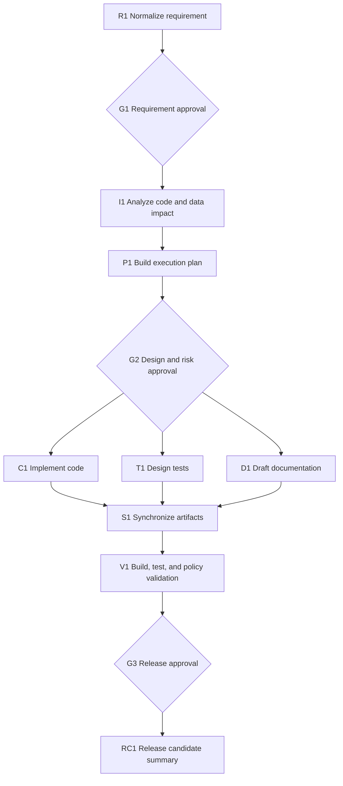

# Greenfield Scenario: Custom URL Aliases

## 1. Purpose

This scenario demonstrates how the agentic SDLC orchestrator handles a well-defined greenfield feature for the existing TinyURL product. The requested capability does not exist in the baseline: clients should be able to choose a memorable alias instead of always receiving a randomly generated short code.

The scenario is designed to demonstrate requirement normalization, dependency-aware task decomposition, parallel execution, human governance, validation, failure recovery, artifact lineage, and release readiness.

> Scenario status: design and orchestration specification. Implementation is intentionally outside the scope of this documentation change.

## 2. Initial request

> Allow a user to provide a custom alias when creating a TinyURL.

Although the intent is clear, the request is not yet engineering-ready. Terms such as "alias," valid input, conflicts, reserved paths, and compatibility with automatic generation must be normalized before implementation.

## 3. Normalized engineering requirement

Extend the existing create-URL API so a client may optionally supply a custom alias.

### Proposed API

```http
POST /api/v1/urls
Content-Type: application/json
```

```json
{
  "url": "https://example.com/products/42",
  "customAlias": "summer-sale"
}
```

Successful response:

```http
HTTP/1.1 201 Created
```

```json
{
  "shortCode": "summer-sale",
  "shortUrl": "http://localhost:8080/summer-sale",
  "originalUrl": "https://example.com/products/42",
  "createdAt": "2026-08-28T15:00:00Z"
}
```

### Business rules

1. `customAlias` is optional.
2. When it is absent or blank, the existing random short-code behavior remains unchanged.
3. An alias must contain 4–30 characters.
4. Allowed characters are ASCII letters, numbers, and hyphens.
5. An alias must start and end with a letter or number.
6. Alias matching is case-insensitive; `Summer-Sale` and `summer-sale` represent the same alias.
7. Stored aliases are normalized to lowercase.
8. Reserved application paths cannot be used. Initial reserved values are `api`, `actuator`, `h2-console`, `health`, and `swagger-ui`.
9. An unavailable alias returns `409 Conflict`.
10. Invalid alias syntax returns `400 Bad Request`.
11. An alias cannot be changed after creation in this iteration.
12. Existing URL creation, redirect, and analytics behavior must remain backward compatible.

## 4. Acceptance criteria

| ID | Acceptance criterion |
|---|---|
| AC-01 | A valid, available alias creates a URL mapping and returns HTTP 201. |
| AC-02 | A request without an alias continues to generate a seven-character code. |
| AC-03 | The alias is normalized to lowercase before uniqueness checks and storage. |
| AC-04 | A duplicate alias returns HTTP 409 and does not modify the existing mapping. |
| AC-05 | Invalid length, characters, boundaries, or reserved values return HTTP 400. |
| AC-06 | A redirect through a custom alias records analytics exactly like a generated code. |
| AC-07 | Concurrent requests for the same alias allow no more than one successful creation. |
| AC-08 | Existing API clients require no request changes. |
| AC-09 | Unit, repository, controller, and end-to-end tests pass. |
| AC-10 | OpenAPI and README documentation describe the new field and error responses. |

## 5. Assumptions and decisions

| Decision | Rationale | Approval |
|---|---|---|
| Alias uniqueness is case-insensitive | Prevents visually confusing duplicate routes | Product approval required |
| Aliases are immutable | Keeps the first release small and avoids redirect migration rules | Product approval required |
| Database uniqueness is authoritative | Application-only checks are unsafe under concurrency | Architecture approval required |
| Conflict response is HTTP 409 | The request is valid, but the desired resource identifier already exists | Architecture approval required |
| Reserved paths are configuration-driven | Allows operational endpoints to evolve without code changes | Architecture approval required |

All decisions are stored with a workflow ID, requirement version, author, timestamp, rationale, and the artifacts they affect.

## 6. Brownfield impact boundary

The feature is greenfield, but it integrates with an existing application. The orchestrator must inspect and protect the current behavior.

| Existing component | Expected impact |
|---|---|
| `CreateUrlRequest` | Add optional `customAlias` field and validation |
| `TinyURLController` | Pass the alias to the service; preserve response contract |
| `UrlService` | Extend the creation contract |
| `UrlServiceImpl` | Normalize, validate, reserve, and select custom/generated code |
| `UrlRepository` | Support normalized uniqueness checks |
| `UrlMapping` | No new column required if aliases continue using `short_code` |
| Exception handling | Add an alias-conflict exception mapped to HTTP 409 |
| Configuration | Add reserved-alias configuration |
| Tests | Extend unit, controller, persistence, concurrency, and end-to-end coverage |
| Documentation | Update API examples, error catalog, and architecture decisions |

The current `short_code` unique constraint is retained. A migration may be needed to enforce case-insensitive uniqueness if the database can contain mixed-case historical codes. This must be resolved at the architecture gate.

## 7. Orchestration graph



A gate may route work backward. For example, a rejected database decision returns execution to impact analysis or planning. This is a controlled state transition, not an unbounded loop.

## 8. Task decomposition

| Task | Owner | Depends on | Output | Exit condition |
|---|---|---|---|---|
| R1 Normalize requirement | Requirement Agent | None | Versioned requirement and acceptance criteria | No unresolved blocking ambiguity |
| G1 Approve requirement | Human product owner | R1 | Approval record | Requirement version approved |
| I1 Analyze impact | Codebase Agent | G1 | Component, API, and data-impact report | All affected paths and risks identified |
| P1 Construct DAG | Planning Agent | I1 | Executable task graph | Graph is acyclic and every task has gates |
| A1 Design API | Architecture Agent | P1 | API/schema proposal | Backward compatibility demonstrated |
| A2 Design persistence | Architecture Agent | P1 | Uniqueness/concurrency decision | Database enforcement approach approved |
| A3 Threat analysis | Security Agent | P1 | Abuse and routing risk report | No unresolved critical finding |
| G2 Approve design | Human technical lead | A1, A2, A3 | Approval record | High-impact decisions approved |
| C1 Update DTO/API | Implementation Agent | G2 | Code patch | Compile-ready change |
| C2 Implement alias rules | Implementation Agent | C1 | Service and validation patch | All business rules represented |
| C3 Implement conflict handling | Implementation Agent | C2 | Exception and HTTP mapping | Conflict contract implemented |
| T1 Unit test design | Test Agent | G2 | Unit-test cases | Acceptance criteria mapped to tests |
| T2 Integration test design | Test Agent | A2, G2 | Repository/concurrency tests | Database behavior covered |
| D1 Draft documentation | Documentation Agent | G2 | README/OpenAPI changes | New contract and examples documented |
| S1 Synchronize artifacts | Orchestrator | C3, T1, T2, D1 | Consistent candidate change set | No contract mismatch |
| V1 Validate | Validation Agent | S1 | Build, tests, policy evidence | Required checks pass |
| G3 Release approval | Human technical lead | V1 | Approval or rejection | Evidence reviewed |
| RC1 Summarize release | Release Agent | G3 | Final engineering summary | Approved artifact references included |

Tasks A1, A2, and A3 execute in parallel. After G2, implementation, test preparation, and documentation also proceed on parallel paths. S1 is a synchronization barrier.

## 9. Entry and exit gates

### G1 — Requirement approval

Entry:

- Intent and users are identified.
- Business rules and acceptance criteria are versioned.
- Open questions are either resolved or explicitly accepted as assumptions.

Exit:

- Product owner approves the exact requirement version.
- Rejection returns the workflow to R1.

### G2 — Design and risk approval

Entry:

- API compatibility analysis is complete.
- Database concurrency and uniqueness behavior are defined.
- Reserved-route and abuse risks are evaluated.
- Rollback strategy is recorded.

Exit:

- Technical lead approves API, persistence, and security decisions.
- Any scope increase produces a new plan version.

### G3 — Release-readiness approval

Entry:

- Build and all required tests pass.
- No critical policy or security findings remain.
- Documentation matches the implemented API.
- Traceability connects every acceptance criterion to evidence.

Exit:

- Human approves creation of a release candidate.
- The orchestrator cannot merge or deploy autonomously.

## 10. Stateful context and lineage

The orchestrator preserves:

- Original request and normalized requirement versions
- Assumptions and resolved questions
- Task graph versions
- Architecture decisions
- Human approvals and rejections
- Agent inputs and structured outputs
- Repository commit and branch references
- Test reports and policy results
- Retry, fallback, rollback, and safe-stop events

Every generated artifact records the requirement version and upstream artifacts used to create it.

If case-sensitivity changes after implementation begins, the orchestrator:

1. Creates a new requirement version.
2. Invalidates persistence design, implementation, related tests, and API documentation.
3. Preserves unaffected security and routing analysis when still valid.
4. Builds a revised dependency graph.
5. Requires renewed design approval.
6. Re-executes only stale tasks.

## 11. Validation strategy

### Unit tests

- Valid alias normalization
- Minimum and maximum lengths
- Invalid characters
- Leading or trailing hyphens
- Reserved aliases
- Alias omitted or blank
- Conflict mapping
- Existing generated-code behavior

### Repository tests

- Case-insensitive lookup
- Unique constraint behavior
- Persistence of normalized aliases
- Existing mapping remains unchanged after a conflict

### Controller tests

- HTTP 201 for valid aliases
- HTTP 400 for invalid aliases
- HTTP 409 for conflicts
- Response-body compatibility
- Redirect and analytics behavior

### Integration tests

- Create, redirect, and inspect analytics using a custom alias
- Two concurrent requests for the same alias
- Existing clients without `customAlias`
- Test-profile database isolation

### Policy and quality checks

- Maven build and tests
- Static analysis
- Dependency vulnerability scan
- Secret scan
- API compatibility check
- Migration review when schema behavior changes
- Change-size and protected-file policy

## 12. Failure handling

| Failure | Orchestrator behavior |
|---|---|
| Agent output fails its schema | Retry twice with validation errors |
| Temporary build infrastructure failure | Retry up to three times with backoff |
| Generated code fails tests | Return failure evidence to the implementation task; maximum two correction cycles |
| API and documentation disagree | Block synchronization and reopen the inconsistent tasks |
| Database cannot guarantee uniqueness | Stop at G2 and require an alternate design |
| Security policy reports a critical issue | Safe stop; human override is not permitted |
| Requirement changes | Mark dependent artifacts stale and generate a revised plan |
| Retry budget is exhausted | Safe stop with diagnostics and recommended recovery |
| Partial repository mutation | Revert only workflow-owned commits on the scenario branch |

## 13. Safety and governance

- Work occurs on a dedicated feature branch.
- Agents cannot write directly to `main`.
- Repository content is treated as untrusted input.
- Tool access follows least privilege.
- Secrets are never written to prompts, logs, source files, or artifacts.
- Database migrations and public API changes require human approval.
- Release and merge actions require explicit human approval.
- Failed mandatory checks cannot be bypassed by an agent.
- All approvals and state changes are audit events.

## 14. Observability and reliability metrics

The scenario records:

- End-to-end workflow latency
- Active execution time and human wait time
- Task and workflow success rate
- First-attempt success rate
- Retry count by task and failure category
- Re-planning frequency
- Rollback and safe-stop frequency
- Mean time to recovery
- Gate rejection frequency
- Test pass rate
- Acceptance-criteria coverage

Because this is a prototype scenario, metrics demonstrate instrumentation and behavior; they are not statistically representative production reliability measurements.

## 15. Expected artifacts

- Normalized requirement specification
- Acceptance-criteria matrix
- Brownfield impact report
- Versioned task graph
- API and persistence decisions
- Threat/risk assessment
- Source-code patch
- Unit and integration tests
- OpenAPI and README changes
- Build and test evidence
- Audit event stream
- Metrics summary
- Human approval records
- Release-readiness report

## 16. Demonstration walkthrough

1. Submit the initial custom-alias request.
2. Inspect the normalized requirement and acceptance criteria.
3. Approve G1.
4. Observe codebase analysis and task-graph generation.
5. Observe API, persistence, and security design execute in parallel.
6. Approve G2.
7. Observe implementation, testing, and documentation paths execute.
8. Inject a recoverable test failure and show a bounded correction cycle.
9. Change the case-sensitivity requirement and demonstrate selective invalidation and re-planning.
10. Review synchronized artifacts and validation evidence.
11. Approve G3.
12. Inspect the final summary, audit history, and reliability metrics.

## 17. Final engineering summary template

The completed workflow produces a summary containing:

- Approved requirement and acceptance criteria
- Plan and architecture rationale
- Changed modules, APIs, schemas, tests, and documentation
- Artifact and commit references
- Human approvals
- Validation evidence
- Risks and mitigations
- Retries, fallback, rollback, or re-planning performed
- Reliability metrics
- Assumptions
- Limitations
- Release recommendation

## 18. Known trade-offs

- Lowercase normalization improves consistency but changes the presentation of user-provided aliases.
- Database-enforced uniqueness is safer but may require a migration or database-specific index.
- Reserved aliases reduce route conflicts but require configuration governance.
- Human gates reduce unsafe autonomy but increase elapsed delivery time.
- Deterministic scenario agents improve repeatability but cannot represent every LLM failure mode.
- Concurrency validation in an embedded database may not reproduce every production-database behavior.
