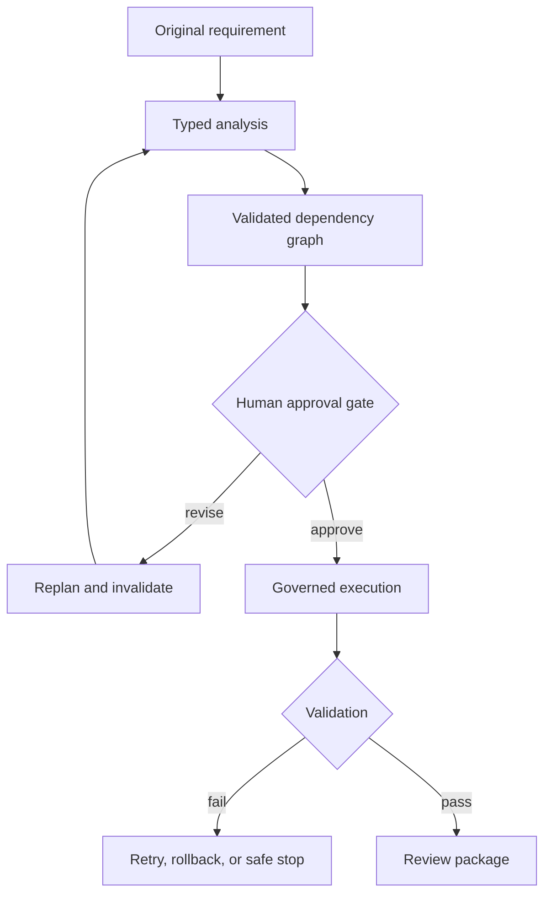
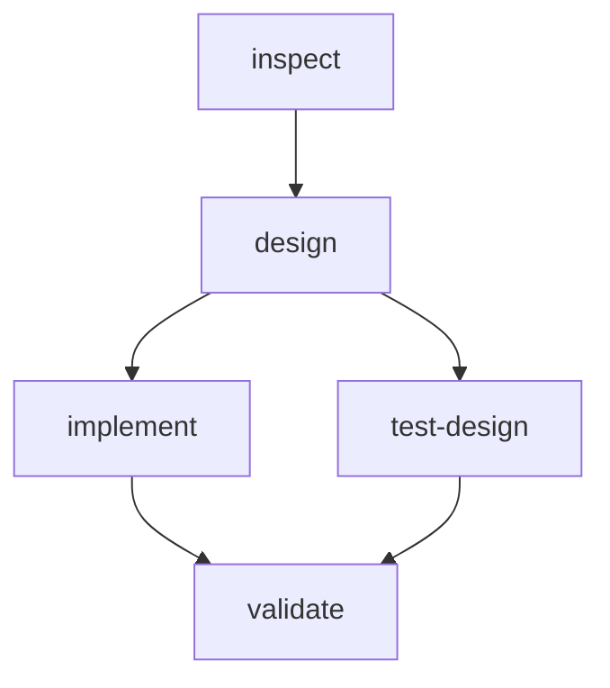
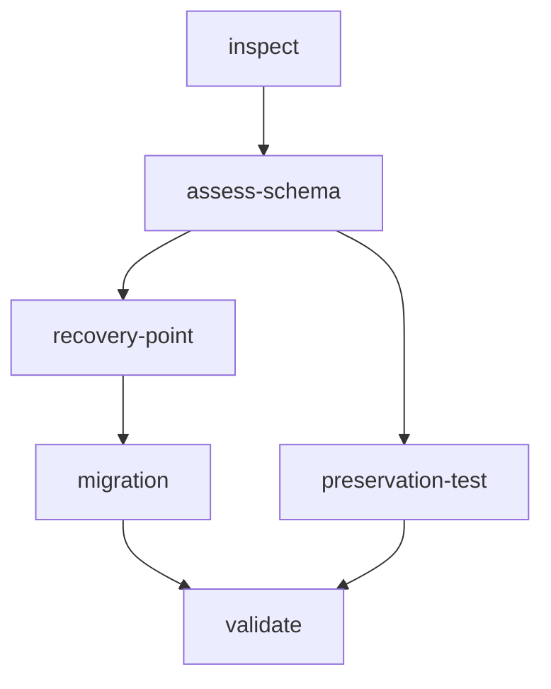
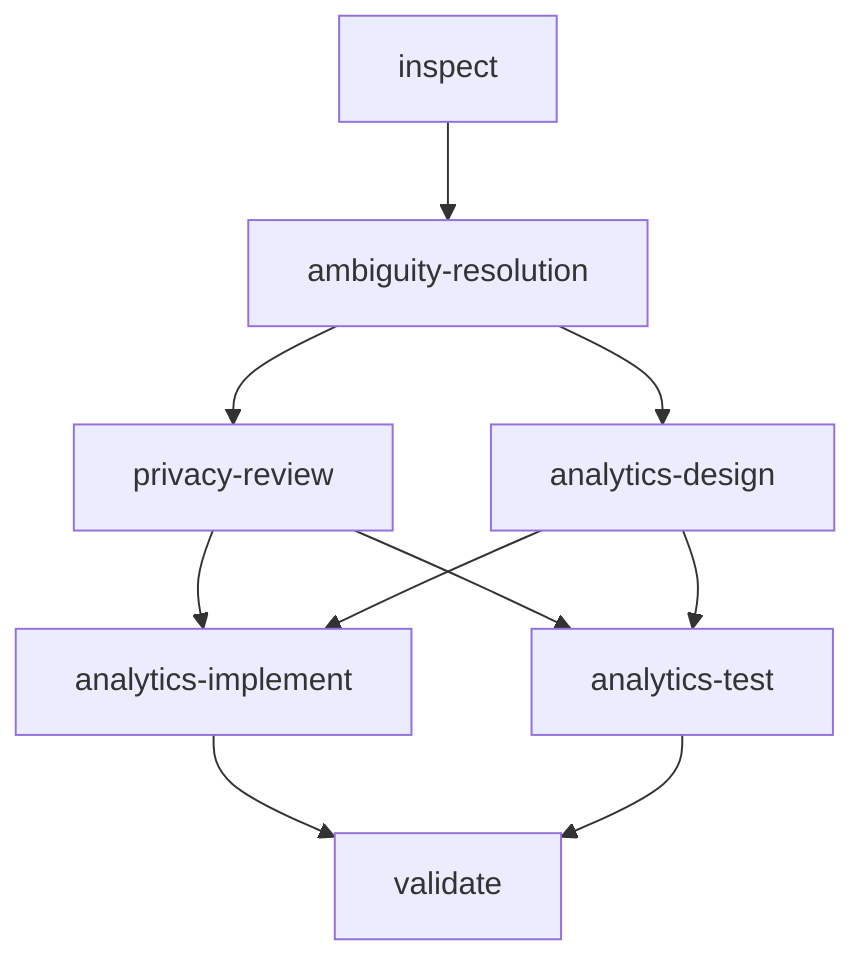

# Three-scenario engineering walkthrough

This document demonstrates how the prototype turns one greenfield, one
brownfield, and one ambiguous requirement into a decomposed, governed, validated,
and reviewable engineering outcome. The plans below are the actual dependency
graphs produced by `WorkflowPlanner`; they are not illustrative alternatives.

## Shared orchestration contract

Every scenario follows the same controlled-autonomy lifecycle:



The dependency graph rejects cycles and missing dependencies before execution.
Only dependency-ready nodes can run; independent nodes run in parallel and join
at downstream validation nodes. Transient failures retry up to the configured
bound. Permanent or policy failures stop safely and trigger reverse-order
compensation for reversible successful tasks. A changed upstream requirement
invalidates transitive dependants and clears prior approvals.

Agents may inspect, analyze, plan, edit bounded feature code, generate tests,
create recovery points, and run local tests. Public API changes and database DDL
require human approval. Commit, push, and deployment remain approval-controlled;
the pull-request merge is the final human release decision.

## Scenario 1: Greenfield URL expiration

### Requirement understanding

| Field | Normalized outcome |
|---|---|
| Original requirement | Add URL expiration and lifecycle management |
| Interpretation | Add optional URL expiration while preserving existing links |
| Main assumption | Expiration is evaluated with an injected UTC clock |
| Ambiguity retained | Whether already-expired timestamps should be rejected or stored as expired |
| Principal risks | Boundary-time races and persisted-record compatibility |
| Repository impact | `TinyURLController`, `UrlMapping`, and `UrlServiceImpl` |

Acceptance criteria require optional UTC `expiresAt`, normal redirect for active
links, HTTP `410` for expired links, HTTP `404` for unknown codes, and unchanged
behavior for links with no expiration.

### Decomposition and orchestration



| Task | Responsibility | Gate or synchronization |
|---|---|---|
| `inspect` | Inspect API, service, persistence, and tests | Entry task |
| `design` | Define expiration contract and failure semantics | Public API change requires approved plan |
| `implement` | Implement expiration lifecycle behavior | Runs after design |
| `test-design` | Create unit and integration validation | Runs in parallel with implementation |
| `validate` | Run build and acceptance tests | Joins implementation and test paths |

The workflow is created in `AWAITING_PLAN_APPROVAL`. Execution is rejected until
a reviewer accepts the contract, compatibility risks, and five-node DAG.

### Validation and evidence

- `UrlExpirationIntegrationTest` validates active, expired, missing, and
  non-expiring behavior through the HTTP and persistence layers.
- Controller, service, domain, and repository tests validate the affected
  components independently.
- `OrchestrationEndToEndTest` verifies the approval stop, five successful tasks,
  success-rate metrics, command audit, and complete artifact list.
- The exit gate is `COMPLETED`, five successful tasks, and traceability coverage
  for every acceptance criterion.

## Scenario 2: Brownfield Flyway migration

### Requirement understanding and impact

| Field | Normalized outcome |
|---|---|
| Original requirement | Replace `create-drop` with Flyway migrations while preserving existing data |
| Interpretation | Make immutable Flyway migrations own schema creation and evolution |
| Main assumption | The existing H2 schema matches the current `UrlMapping` entity |
| Ambiguity retained | Production backup location and retention need environment-specific approval |
| Principal risks | Incorrect baselining, data loss, and ORM/schema drift |
| Repository impact | `pom.xml`, local/test configuration, migrations, and `UrlMapping` |

Acceptance criteria cover clean creation, safe baselining, row preservation,
Hibernate validation-only behavior, startup failure on migration errors, and a
recorded recovery procedure before DDL.

### Decomposition and orchestration



| Task | Responsibility | Gate or synchronization |
|---|---|---|
| `inspect` | Analyze schema ownership and data flow | Entry task |
| `assess-schema` | Compare entity, existing schema, and migration target | Establishes migration preconditions |
| `recovery-point` | Record a verified recovery point | Must precede migration |
| `migration` | Apply versioned Flyway ownership | Requires separate schema approval |
| `preservation-test` | Test clean migration and existing-row preservation | Runs alongside recovery/migration path |
| `validate` | Validate migration, ORM, recovery, and application tests | Synchronizes both paths |

Plan approval moves the workflow to `AWAITING_SCHEMA_APPROVAL`, not directly to
execution. An attempted execution at that state is rejected. Only the database
owner's scoped approval moves it to `READY_FOR_EXECUTION`.

### Validation, failure recovery, and evidence

- `FlywayDataPreservationIntegrationTest` verifies clean migration and retained
  rows for the existing-schema path.
- `TestProfileIntegrationTest` verifies that the test profile uses the migrated
  schema rather than Hibernate schema mutation.
- `BrownfieldWorkflowIntegrationTest` verifies repository-impact analysis, the
  six-node graph, execution denial before schema approval, both human gates,
  completion, and success metrics.
- Migration or validation failure exhausts only its bounded retry allowance,
  safe-stops the workflow, records attempts and rollback results, and leaves the
  database recovery procedure in `docs/flyway-recovery.md`.
- Replanning from `assess-schema` invalidates the recovery point, migration,
  preservation test, and final validation, then clears both approvals.

## Scenario 3: Ambiguous richer analytics

### Ambiguity resolution

| Field | Normalized outcome |
|---|---|
| Original requirement | Provide richer analytics |
| Bounded interpretation | Add link age and average redirects per active day using stored aggregate data |
| Main assumptions | “Richer” means aggregate metrics; active-day denominator is at least one UTC day |
| Explicitly unresolved | Requested dimensions and retention were not defined |
| Privacy boundary | No IP, user agent, referrer, location, or visitor identifier |
| Availability boundary | Analytics reads and derived calculations cannot block redirect processing |

The plan retains the ambiguity instead of silently inventing visitor analytics.
Human plan approval accepts or rejects the aggregate-only interpretation before
implementation. Existing response fields must remain backward compatible and
the API reports `dataScope=AGGREGATE_ONLY`.

### Decomposition and orchestration



| Task | Responsibility | Gate or synchronization |
|---|---|---|
| `inspect` | Inspect analytics data flow and redirect critical path | Entry task |
| `ambiguity-resolution` | Convert “richer” into a measurable bounded contract | Preserves assumptions and exclusions |
| `privacy-review` | Confirm data minimization | Parallel review path |
| `analytics-design` | Design compatible aggregate fields | Public API change under approved plan |
| `analytics-implement` | Calculate aggregate metrics | Joins privacy and design decisions |
| `analytics-test` | Test calculations, privacy, and redirect isolation | Parallel with implementation |
| `validate` | Run contract and availability validation | Final synchronization |

### Validation and accepted limitations

- `AmbiguousAnalyticsWorkflowIntegrationTest` verifies two captured ambiguities,
  the approval stop, seven-node graph, execution denial before approval, and
  successful governed completion.
- Service and controller tests verify deterministic metric calculations,
  backward-compatible fields, aggregate-only scope, and absence of prohibited
  visitor data.
- Redirect behavior remains independent of analytics reads.
- Accepted limitation: keyword-based analytics scenario detection is broad and
  can classify a more specific analytics request as this bounded scenario.
- Accepted limitation: the expired-link average-rate denominator continues to
  grow after expiration; a future contract must define whether the measurement
  window should stop at expiration.

## Review package and traceability

Running `scripts/demo-all-scenarios.sh` creates one execution directory per
scenario under `build/orchestration-runs/{executionId}`. Each directory contains:

```text
requirement.md
normalized-requirement.json
acceptance-criteria.json
dependency-graph.json
plan.md
approvals.json
decisions.json
command-audit.jsonl
changed-files.json
test-results.json
traceability-matrix.md
risk-report.md
metrics.json
engineering-summary.md
```

`workflow.json`, `events.jsonl`, and `commands.jsonl` are also retained for
recovery and backward compatibility. `changed-files.json` explicitly reports
that the deterministic task adapter records declared repository impacts rather
than claiming an observed Git diff. `test-results.json` similarly distinguishes
orchestration validation attempts from a parsed external test report.

The demonstration succeeds only when all three scenarios reach `COMPLETED` with
a success rate of `1.0`. CI verification and human pull-request review/merge are
the final release-readiness controls.

## Source evidence index

| Evidence | Location |
|---|---|
| Scenario requirements | `orchestration/requirements/` |
| Analyzer and impact model | `RequirementAnalyzer` |
| Actual dependency graphs | `WorkflowPlanner` |
| Policy boundaries | `PolicyEngine` |
| Parallel execution, retries, rollback, safe stop | `WorkflowExecutionEngine` |
| Approval and replanning lifecycle | `WorkflowService` |
| Review-package generation | `ArtifactStore` |
| Scenario integration tests | `src/test/java/com/tinyurl/integration/` |
| Live demonstration | `scripts/demo-all-scenarios.sh` |
