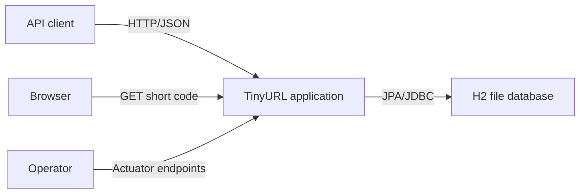
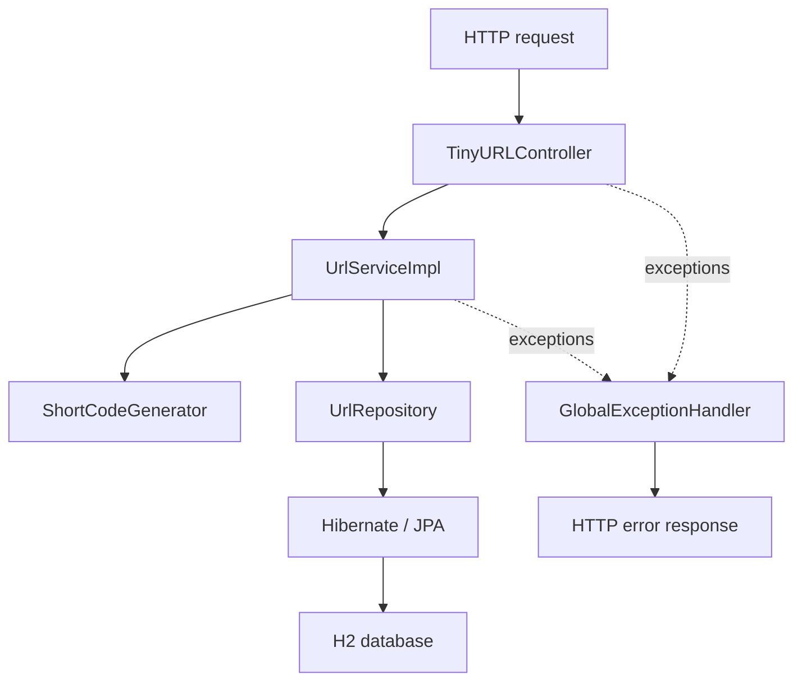
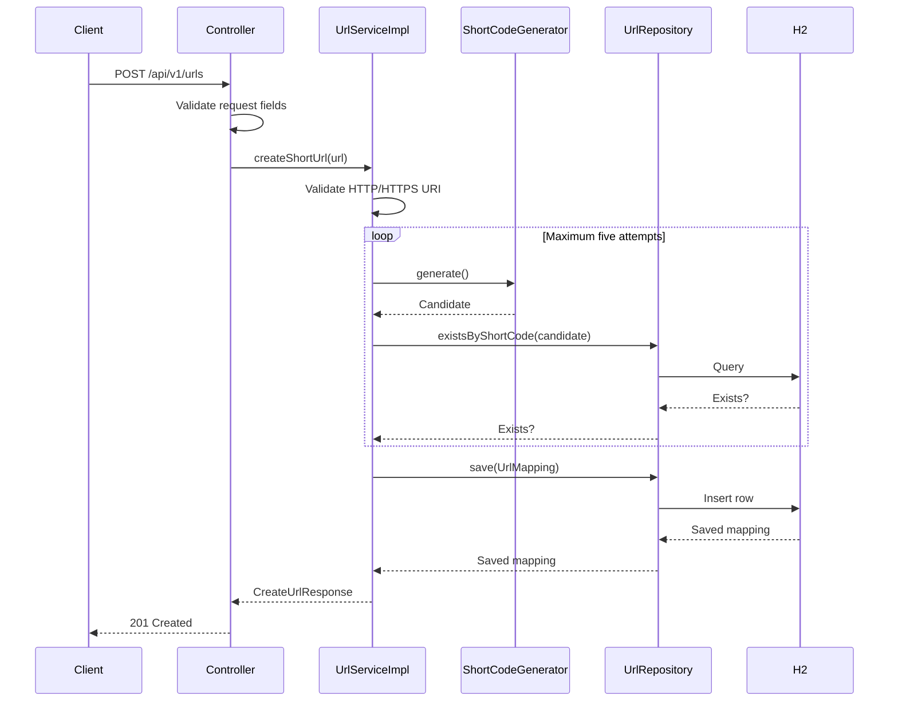
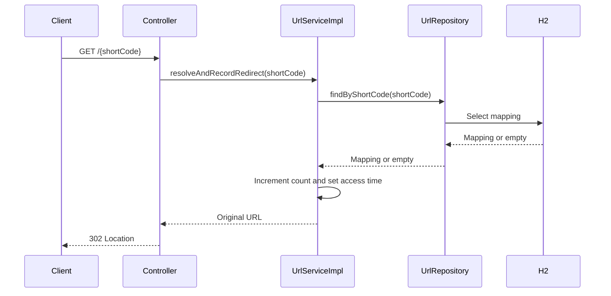
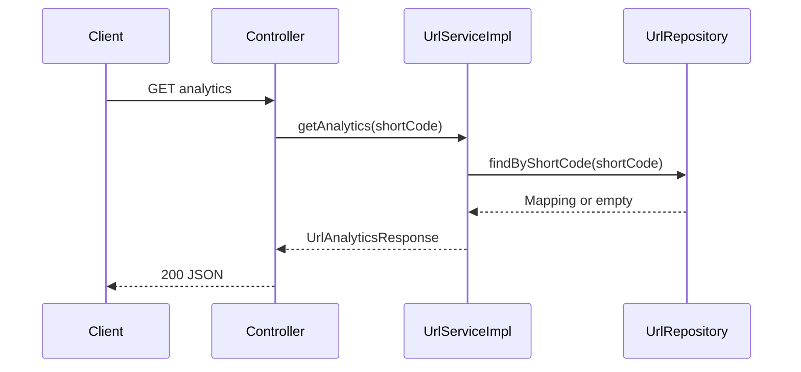
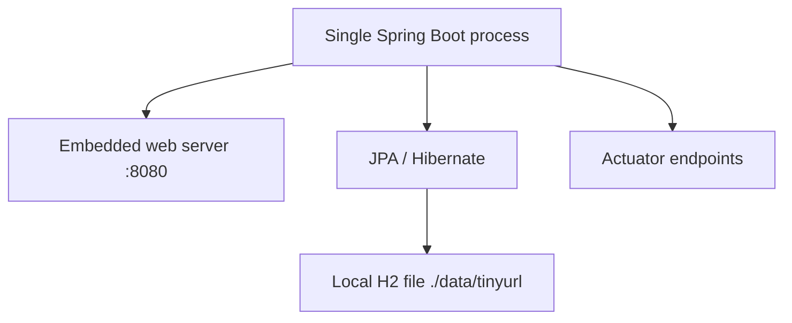

# TinyURL Application Architecture

## 1. Document purpose

This document describes the architecture of the TinyURL application as it exists in the `main` branch. It is a current-state description of the implemented code, runtime dependencies, request flows, persistence model, tests, and operational characteristics.

It does not describe the proposed agentic SDLC orchestration platform or unimplemented future features.

## 2. System responsibility

TinyURL is a Spring Boot REST application that provides three capabilities:

1. Create a short URL for an HTTP or HTTPS URL.
2. Redirect a short code to its original URL.
3. Retrieve redirect analytics for a short code.

The application generates seven-character alphanumeric codes, persists URL mappings in H2, counts redirects, and returns structured error responses for invalid URLs and missing short codes.

## 3. Technology stack

| Area | Current technology |
|---|---|
| Language | Java 21 |
| Application framework | Spring Boot 4.1.1 |
| Web | Spring MVC |
| Validation | Jakarta Bean Validation |
| Persistence | Spring Data JPA and Hibernate |
| Database | H2 file database |
| Transactions | Spring transaction management |
| Monitoring | Spring Boot Actuator |
| Resilience dependency | Spring Cloud Circuit Breaker with Resilience4j |
| Testing | JUnit 5, Mockito, Spring Test, MockMvc |
| Build | Maven Wrapper |
| CI | GitHub Actions |

The Resilience4j dependency is present, but the current application code does not call an external service and does not define a circuit breaker.

## 4. System context



### External actors

| Actor | Interaction |
|---|---|
| API client | Creates short URLs and requests analytics |
| Browser or redirect client | Resolves a short code and receives an HTTP redirect |
| Operator | Reads exposed Actuator health, info, and metrics endpoints |

There are no implemented authentication, authorization, message broker, cache, or external-service integrations.

## 5. Container and component architecture

The application is deployed as one Spring Boot process.



### 5.1 Controller layer

Class:

`src/main/java/com/tinyurl/controller/TinyURLController.java`

Responsibilities:

- Defines the REST endpoints.
- Deserializes request JSON.
- Invokes Jakarta validation on URL-creation requests.
- Delegates business behavior to `UrlService`.
- Builds HTTP 201 and HTTP 302 responses.
- Returns analytics as JSON.

The controller contains no persistence logic and does not generate short codes.

### 5.2 Service layer

Interface:

`src/main/java/com/tinyurl/service/UrlService.java`

Implementation:

`src/main/java/com/tinyurl/service/impl/UrlServiceImpl.java`

Responsibilities:

- Validates that an original URL is a syntactically valid HTTP or HTTPS URI with a host.
- Generates a unique short-code candidate.
- Retries code generation up to five times when a candidate already exists.
- Creates and persists `UrlMapping` entities.
- Resolves short codes.
- Records redirect counts and last-access timestamps.
- Produces response DTOs.
- Defines transactional boundaries.

The service currently constructs the public short URL with a hard-coded base URL:

`http://localhost:8080`

Time is obtained through an internally constructed UTC system clock.

### 5.3 Short-code generator

Class:

`src/main/java/com/tinyurl/util/ShortCodeGenerator.java`

Behavior:

- Uses `SecureRandom`.
- Selects characters from lowercase letters, uppercase letters, and digits.
- Produces exactly seven characters.
- Has (62^7), or approximately 3.52 trillion, possible codes.

The generator does not check uniqueness. Uniqueness checking belongs to the service and database layers.

### 5.4 Repository layer

Interface:

`src/main/java/com/tinyurl/domain/UrlRepository.java`

The repository extends `JpaRepository<UrlMapping, Long>` and declares:

- `findByShortCode(String shortCode)`
- `existsByShortCode(String shortCode)`

Standard persistence operations such as `save` are inherited from `JpaRepository`. The interface currently redeclares `save`, although this is not required.

### 5.5 Domain entity

Class:

`src/main/java/com/tinyurl/domain/UrlMapping.java`

The entity represents one mapping between a short code and an original URL.

| Field | Database column | Constraints |
|---|---|---|
| `id` | Primary key | Generated identity |
| `shortCode` | `short_code` | Required, maximum 12 characters, unique |
| `originalUrl` | `original_url` | Required, maximum 2048 characters |
| `createdAt` | `created_at` | Required |
| `redirectCount` | `redirect_count` | Required |
| `lastAccessedAt` | `last_accessed_at` | Optional |

The `recordRedirect(Instant)` domain method increments `redirectCount` and replaces `lastAccessedAt`.

### 5.6 DTOs

| DTO | Purpose |
|---|---|
| `CreateUrlRequest` | Accepts and validates the original URL |
| `CreateUrlResponse` | Returns the generated code, public short URL, original URL, and creation time |
| `UrlAnalyticsResponse` | Returns mapping details, redirect count, and access timestamps |
| `ApiError` | Provides a consistent error response |

Java records are used for immutable API data transfer objects.

### 5.7 Exception handling

Classes:

- `InvalidUrlException`
- `UrlNotFoundException`
- Nested `InvalidUrlException.GlobalExceptionHandler`

The `@RestControllerAdvice` maps:

| Condition | HTTP status |
|---|---|
| Invalid URL | 400 Bad Request |
| Bean-validation failure | 400 Bad Request |
| Missing short code | 404 Not Found |

The error response includes timestamp, numeric status, reason phrase, message, and request path.

## 6. REST API

### 6.1 Create a short URL

```http
POST /api/v1/urls
Content-Type: application/json
```

Request:

```json
{
  "url": "https://example.com/articles/1"
}
```

Successful response:

```http
HTTP/1.1 201 Created
```

```json
{
  "shortCode": "Ab12xYz",
  "shortUrl": "http://localhost:8080/Ab12xYz",
  "originalUrl": "https://example.com/articles/1",
  "createdAt": "2026-08-28T15:00:00Z"
}
```

Validation:

- `url` cannot be null, empty, or blank.
- Its maximum length is 2048 characters.
- The service accepts only `http` and `https`.
- The URI must contain a host.

### 6.2 Redirect

```http
GET /{shortCode}
```

Successful response:

```http
HTTP/1.1 302 Found
Location: https://example.com/articles/1
```

Resolving a code also increments its redirect count and records the current UTC time.

### 6.3 Analytics

```http
GET /api/v1/urls/{shortCode}/analytics
```

Successful response:

```json
{
  "shortCode": "Ab12xYz",
  "originalUrl": "https://example.com/articles/1",
  "redirectCount": 1,
  "createdAt": "2026-08-28T15:00:00Z",
  "lastAccessedAt": "2026-08-28T15:05:00Z"
}
```

A code that has never been redirected has a count of zero and a null `lastAccessedAt`.

## 7. Request flows

### 7.1 URL creation flow



If all five generated candidates already exist, the service throws `IllegalStateException`. The current global exception handler does not explicitly map that exception.

### 7.2 Redirect flow



The service method is transactional. Hibernate dirty checking persists the changed count and timestamp when the transaction commits.

### 7.3 Analytics flow



The analytics transaction is read-only.

## 8. Persistence architecture

The configured database URL is:

```text
jdbc:h2:file:./data/tinyurl;AUTO_SERVER=TRUE
```

The database files are therefore created relative to the process working directory under `./data`.

Current JPA settings:

- H2 dialect
- `ddl-auto: create-drop`
- Open Session in View disabled
- SQL logging disabled

### Persistence implications

- Data is stored in a local file rather than a network database.
- `AUTO_SERVER=TRUE` permits multiple processes to access the same H2 database file under H2's supported automatic mixed mode.
- `create-drop` recreates the schema for each application lifecycle and is not appropriate for retaining production data.
- The repository currently includes an H2 database file under `data/`.
- There is no schema migration tool such as Flyway or Liquibase.
- The unique database constraint on `short_code` is the final uniqueness protection.

## 9. Transaction and concurrency behavior

| Operation | Transaction |
|---|---|
| Create URL | Read/write |
| Resolve and record redirect | Read/write |
| Get analytics | Read-only |

### Current concurrency risks

1. Code creation performs an existence check followed by an insert. Two concurrent transactions can both observe a candidate as available. The database unique constraint prevents duplicate rows, but the resulting constraint exception is not converted into a retry or a documented API error.
2. Redirect counting uses a read-modify-write entity update with no `@Version` field or atomic database increment. Concurrent redirects may overwrite one another and lose increments.
3. The application is designed as a single process using a local H2 file. It is not currently designed for horizontally scaled production deployment.

These are current-state limitations, not behavior guaranteed by the architecture.

## 10. Configuration and operations

Application configuration is located at:

`src/main/resources/application.yaml`

### Runtime settings

| Setting | Current value |
|---|---|
| Application name | `tinyurl` |
| HTTP port | `8080` |
| Database | H2 file at `./data/tinyurl` |
| H2 console | Enabled at `/h2-console` |
| Exposed Actuator endpoints | health, info, metrics |
| Health details | Shown when authorized |

The application does not currently define Spring Security. As a result, the operational protection implied by “when authorized” is not backed by an application security configuration.

### Configuration limitations

- Public base URL is hard-coded in `UrlServiceImpl`.
- Database credentials are stored in application configuration.
- Local, test, and production profiles are not separated.
- H2 console is enabled in the default profile.
- There is no documented environment-variable contract.
- There is no application-specific health indicator for database or redirect behavior beyond framework-provided checks.

## 11. Deployment view



The present deployment model is suitable for local development and demonstration. It does not include:

- Reverse proxy or API gateway
- TLS termination
- Container definition
- External database
- Distributed cache
- Load balancing
- Horizontal scaling
- Centralized logging
- Distributed tracing
- Authentication or authorization

## 12. Testing architecture

Current test classes:

| Test class | Scope |
|---|---|
| `TinyurlApplicationTests` | Spring application context |
| `TinyURLControllerTest` | Controller behavior using standalone MockMvc and mocked service |
| `UrlServiceImplTest` | Service behavior with mocked repository and generator |
| `UrlMappingTest` | Domain redirect-count behavior |
| `ShortCodeGeneratorTest` | Generated-code length and character set |

Covered behavior includes:

- Successful creation
- Invalid URL rejection
- Short-code collision retries
- Retry exhaustion
- Redirect recording
- Analytics mapping
- Missing codes
- Request validation
- HTTP response statuses and headers
- Structured API errors
- Code format

Current gaps:

- No repository integration test
- No full HTTP/database end-to-end test
- No concurrent redirect-count test
- No database constraint-conflict test
- No Actuator test
- No test-specific application configuration
- No coverage threshold or static-analysis gate

## 13. Build and continuous integration

The Maven build is defined in `pom.xml` and uses Java 21.

The workflow at `.github/workflows/maven.yml`:

- Checks out the repository.
- Configures Temurin Java 21.
- Enables Maven dependency caching.
- Makes the Maven wrapper executable.
- Runs `./mvnw clean verify`.
- Uploads Surefire reports when the build fails.

At the time of this architecture baseline, the workflow trigger is configured for `Branch1` pushes and pull requests targeting `Branch1`, plus manual execution. It does not automatically run for `main` or other feature branches.

## 14. Security considerations

### Implemented controls

- Only HTTP and HTTPS original URLs are accepted.
- URL length is limited.
- Request DTO fields use Bean Validation.
- Persistence uses JPA rather than manually constructed SQL.
- Errors use structured responses rather than exposing stack traces through the defined handlers.

### Current risks

- No authentication or authorization.
- Anyone with network access can create URLs or read analytics.
- Redirect targets are not checked against private, loopback, link-local, or otherwise sensitive destinations.
- The service can be used for malicious or deceptive links.
- No rate limiting or abuse prevention.
- H2 console is enabled by default.
- Actuator metrics are exposed.
- No explicit security headers.
- No secret-management integration.
- No dependency or source vulnerability scanning in CI.
- No retention or deletion policy for stored URLs.
- Error handling does not explicitly cover every runtime failure.

## 15. Architecture qualities

| Quality | Current assessment |
|---|---|
| Maintainability | Clear controller/service/repository separation; field injection and hard-coded configuration reduce testability |
| Testability | Strong isolated unit tests; missing persistence and end-to-end coverage |
| Reliability | Database uniqueness constraint exists; concurrency and recovery behavior are limited |
| Scalability | Single-node, local-file design |
| Security | Basic input validation only |
| Observability | Basic Actuator health, info, and metrics |
| Portability | Java/Spring application is portable; local H2 file and hard-coded URL constrain deployment |
| Availability | No redundancy or external durable datastore |
| Performance | Adequate for a demonstration; no caching, load testing, or capacity evidence |

## 16. Current architecture decisions

### ADR-001: Layered Spring Boot application

Decision: Separate HTTP, business logic, persistence, domain, and DTO responsibilities.

Rationale: Keeps a small application understandable and independently testable.

### ADR-002: Random seven-character short codes

Decision: Generate codes using `SecureRandom` and a 62-character alphabet.

Rationale: Provides a large identifier space without maintaining a numeric sequence.

### ADR-003: Database-enforced uniqueness

Decision: Apply a unique constraint to `short_code`.

Rationale: Protects stored data even if application-level collision checks race.

### ADR-004: H2 file persistence

Decision: Store development data in a local H2 file.

Rationale: Minimizes setup requirements for the baseline application.

Trade-off: Limits production durability, scalability, and operational safety.

### ADR-005: Transactional redirect recording

Decision: Resolve and update redirect analytics in one service transaction.

Rationale: Keeps lookup and tracking within a single application operation.

Trade-off: The current read-modify-write approach can lose concurrent increments.

### ADR-006: Open Session in View disabled

Decision: Set `spring.jpa.open-in-view` to false.

Rationale: Keeps persistence access inside explicit service transactions and avoids hidden database access during response rendering.

## 17. Known limitations and improvement boundaries

The following changes are reasonable future work but are not part of the current architecture:

- Externalize the public base URL.
- Replace field injection with constructor injection.
- Inject `Clock` for deterministic time behavior.
- Add local, test, and production profiles.
- Use an in-memory isolated database for automated tests.
- Introduce PostgreSQL and database migrations for production.
- Make redirect counting atomic or optimistic-lock protected.
- Translate uniqueness races into controlled retries or HTTP conflicts.
- Add authentication, authorization, rate limits, and abuse controls.
- Disable H2 console outside local development.
- Add OpenAPI documentation.
- Add repository and end-to-end integration tests.
- Run CI for `main` and all pull requests.
- Add container and deployment definitions.
- Add structured logging, tracing, and production metrics.

## 18. Architecture validation checklist

The current architecture is considered correctly documented when:

- Every implemented REST endpoint is represented.
- Component responsibilities match the source code.
- Entity fields match the JPA model.
- Transaction boundaries match the service annotations.
- Database location and lifecycle match `application.yaml`.
- Test inventory matches `src/test`.
- CI behavior matches the workflow file.
- Unimplemented capabilities are clearly identified as limitations rather than presented as existing features.
